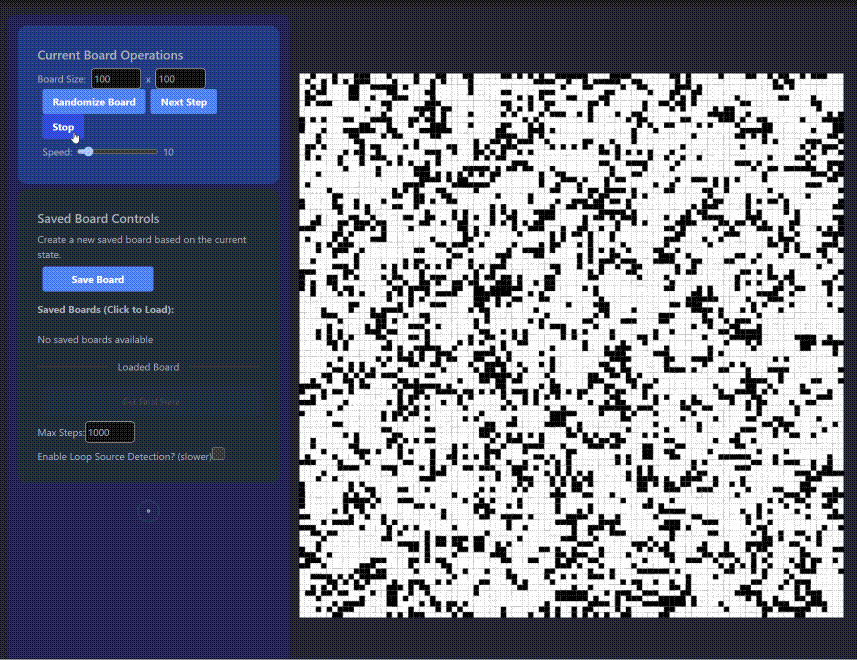

# Conway's Game of Life - .NET Experiment

This is a [Game of Life](https://en.wikipedia.org/wiki/Conway%27s_Game_of_Life) experiment, running on .NET 8 using [Aspire](https://learn.microsoft.com/en-us/dotnet/aspire/get-started/aspire-overview).



## Running the Experiment

> *Pre-Requisites*
> - .NET 8 SDK
> - .NET Aspire Workload ([See These Instructions](https://learn.microsoft.com/en-us/dotnet/aspire/fundamentals/setup-tooling?tabs=windows&pivots=visual-studio))
> - Docker Desktop (See above link for alternatives)
> - Node.js (For the front-end)

#### Restore UI Dependencies

```PowerShell
cd .\GameOfLife.UI\
npm install
```

#### Run the Aspire "AppHost" Orchestration Project

```PowerShell
dotnet run --project .\GameOfLife.AppHost\GameOfLife.AppHost.csproj
```

This should install missing NuGet packages and start the Aspire project.
If everything goes well, the following things should happen:
1. The dependent WebAPI, configuration, and UI projects should be built and started.
2. The Redis hosting dependency should trigger the creation and start of a Redis container.

#### Viewing the Aspire Dashboard

When run from Visual Studio or Rider, the dashboard should open automatically, which
will list all the services, their status, and logs. From the CLI output, you can also
control-click on the link to open the dashboard in your browser.

#### Viewing the Front-End

The dashboard should list the front-end service, which you can click to open in your browser.

## Features

### HTTP Request Tests

Some HTTP tests are included in the GameOfLife.WebAPI project, in the [GameOfLife.WebAPI.http](GameOfLife.WebAPI/GameOfLife.WebAPI.http) file.
These can be run directly in most IDE's.

### UI Features

> NOTE: All operations are performed on the server-side, so the UI is just a view of the current state of the grid, rendered
> using a canvas element.

Once loaded, the UI will present an initial random grid of cells. The following operations are available:

#### Current Board Operations
- Change the board size, which is reflected after clicking "Randomize Board"
- View the next state of the board by clicking "Next Step"
- Perform a continuous simulation of the Game of Life by clicking "Play"
- Adjust the speed of the simulation using the "Speed" slider

> NOTE: Each step of the board is calculated on the server-side, so every frame of the simulation is a new request to the server.
> The speed slider controls how often the server is queried for the next state.

#### Saved Board Controls

Saved board data is stored in Redis, and can survive the API service crashing and restarting. This also
allows for multiple services to be able to share saved board data. (This should likely be extended to leverage
persistent storage, but it's just a PoC for now.)

- The current board state can be saved by clicking "Save Board". Once saved, an ID is generated and the list of
saved boards are updated with the new board ID.
- Saved boards can be loaded by clicking their created UI.
- Once a saved board is loaded you can click "Get Final State" to have the server determine the final
state of the simulation. A status message will be displayed once the final state is determined, of one of the error states
occur.

> Note on "Get Final State"
> * "Max Steps" determine how many steps will be executed to determine the final state. If the board reaches a stable state
> before max steps, the process will complete, and the status will reflect the final state was determined.
> * Once the "Get Final State" call completes, the current grid will reflect the final state of the board.
> * If a loop was detected in the simulation, the status will reflect that.
> * If loop source detection is enabled, the status will indicate the source of the loop.
> * Once a loop is detected, you can click "Play" to see a visual representation of the loop.
> To determine the state of the board at a certain step, change the max steps to that value, then run "get final state".


## Implementation Notes

### Grid Packing and Efficiency

#### UI Grid Representation

The grid is represented as a 2D array of booleans (`boolean[][]`, to be precise), where `true` represents a live cell, 
and `false` represents a dead cell.

#### Network Efficiency

Grid data is sent to and from as a base64-encoded byte array of packed bits. This allows for efficient transfer of grid
data over the network.

For testing, an array of 1's and 0's in integer form is also supported.

#### Grid Rendering Optimizations

The canvas API is used to render the grid to the browser. For efficiency, only cells that have changed state are re-rendered
between steps.

### Loop Detection

Loop detection is implemented through the use of a [Bloom Filter](https://en.wikipedia.org/wiki/Bloom_filter) 
(specifically, [BloomFilter.NetCore](https://github.com/vla/BloomFilter.NetCore/tree/main)). Although this approach could
technically lead to false positives, the probability of this is low enough that it is considered acceptable for this experiment.

The packed grid data is used as the input to the Bloom Filter, and the filter is checked after each step to determine if a loop
has occurred. Each state of the grid is added to the filter by the solver, using the MurmurHash non-crypto algorithm. This
provides great performance and a low probability of false positives due to good hash distribution.

Alternative methods of loop detection might involve storing a hash of every historical state of the grid, but this wouldn't
be as efficient as a Bloom Filter.

